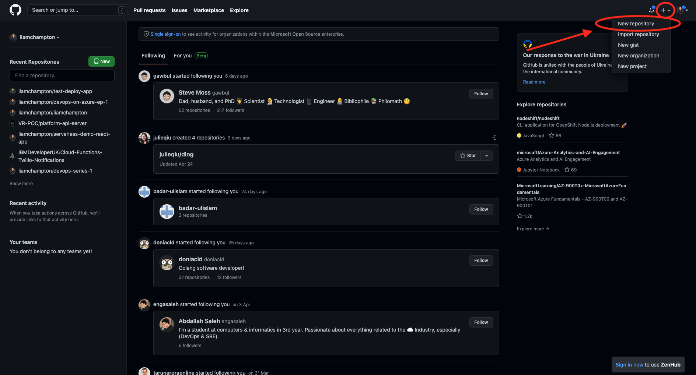
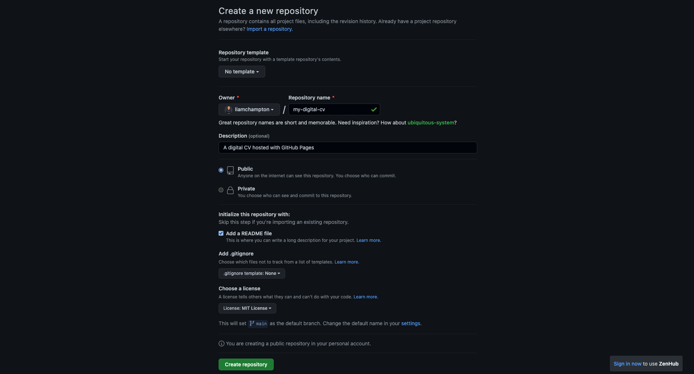

# build-your-own-cv
Build your own CV using GitHub Pages

Gone are the days of the poorly formatted and fiddly Word Documents and PDFs. In this lab you are going to build your own online CV that you can present to prospective employers. Through the lab you will learn how to write HTML and style it with CSS.

## Step 1
Log into [GitHub]() and create a new repository as shown below

Fill in the information on the screen with the following:
- Name = my-digital-cv (feel free to call this something personal eg. liams-digital-cv)
- Description (optional) = A digital CV hosted with GitHub Pages
- Public = this makes the code repository public and allows anyone on the internet to see it
- Add a README.md file
- License = MIT
- Click `Create repository`

