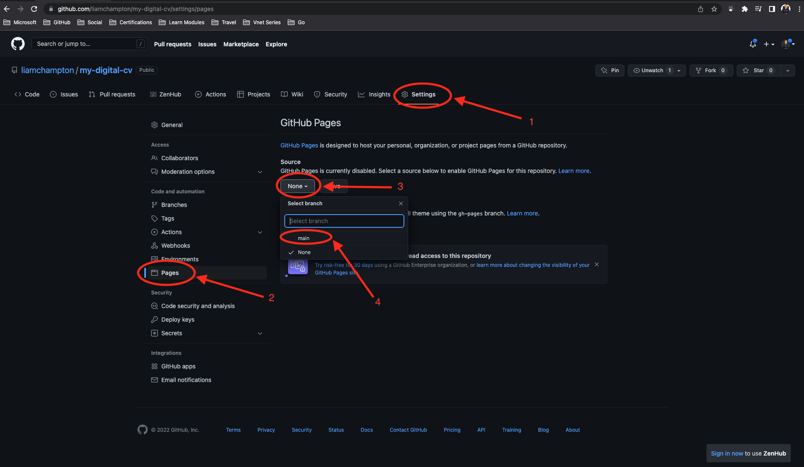

# build-your-own-cv
Build your own CV using GitHub Pages

Gone are the days of the poorly formatted and fiddly Word Documents and PDFs. In this lab you are going to build your own online CV that you can present to prospective employers. Through the lab you will learn how to write HTML and style it with CSS.

## Step 1 - Create your code repository
Log into [GitHub](https://github.com/) and create a new repository as shown below


Fill in the information on the screen with the following:
- Name = my-digital-cv (feel free to call this something personal eg. liams-digital-cv)
- Description (optional) = A digital CV hosted with GitHub Pages
- Public = this makes the code repository public and allows anyone on the internet to see it
- Add a README.md file
- License = MIT
- Click `Create repository`


It should then look something like


## Step 2 - Install CodeSwing plugin

In the URL address bar, add the following prefix to the new repository url `vscode.dev/` and press "Enter" (as shown below)


It should then look something like this


Next you need to install a new plugin called `CodeSwing`. This plugin allows you to see your code edits as you make them all from within the browser window.

On the left menu, click on the 4 small boxes icon. Then type into the search bar `codeswing`. Click on the top result and select `install`.


## Step 3 - Initialise the project workspace

Now the plugin is installed you now need to initialise the workspace using the CodeSwing plugin. To do that, go back to the main project folder (shown below).


Next, open the VS Code command palette by navigating to `View` -> `Command Palette...` and follow the steps below to initialise a `CodeSwing` workspace.


Search for `CodeSwing` and select the option `CodeSwing: Initialize Workspace as Swing`


In the next option menu, select the option `Basic: HTML-Only` as you are only writing HTML and CSS in this workshop 


The page will reload and you will see it split in half. On the left you will have an open `index.html` file and on the right, a preview of the `index.html` file. In the Workspace, you will also see some new files have been created. It should now look like this


---
**Optional Step** 

In the `index.html` file, on the left side of the split window, type `<h1> Hello World! </h1>` and you can watch it appear on the right side of the screen as a preview for what it will look like on the internet **(make sure to remove anything you write in this file before going onto the next step)**.

---

## Step 4 - Write some code!

Now you have a CodeSwing workspace set up and the files are ready in your directory, you need to write some code for the digital CV.

I have written some code for you in this repository. Navigate to the file [index.html](./index.html) and copy the paste it into your `index.html` file. It should look basic, with no colour or pictures. Have a look at the code before pasting it into your file and see what is going on.


We now need to spruce it up and give it some colour and some context. Below the title `Home Simpson CV` add the following lines of code

```html
<link rel="stylesheet" href="https://www.w3schools.com/w3css/4/w3.css">
<link rel='stylesheet' href='https://fonts.googleapis.com/css?family=Roboto'>
<link rel="stylesheet" href="https://cdnjs.cloudflare.com/ajax/libs/font-awesome/4.7.0/css/font-awesome.min.css">
<style>
    html,
    body,
    h1,
    h2,
    h3,
    h4,
    h5,
    h6 {
        font-family: "Roboto", sans-serif
    }
</style>
```

It will now look much better but it is still missing a picture!


To get the picture, save the [homer-simpson.jpg](./assets/homer-simpson.jpeg) from this repository to your computer and drag/drop it into your VS Code project in the browser. **Ensure the name of the file matches the name in the code - `homer-simpson.jpeg`**

Save your `index.html` file (CMD/CTRL +S)


## Step 5 - Host it with GitHub Pages

The CV is now built and now it is time to host it as a website!

The first step is to commit the changes you have just made to the main branch of code. To do that, on the left hand side menu go to the GitHub icon and ensure you are signed in. On the sign in prompt, click `Accept/Allow`


Once signed in, you can now commit the changes and push the code to the GitHub repository. To do that, navigate to the fork icon on the left menu, add a message and click on the tick as shown below.


If you now navigate to the repository in GitHub you will see the code you have just added.


From here we need to enable GitHub Pages to use the `index.html` file and render it as a web page. To do that, open the `Settings` tab of the project repository and select `Pages`. On this page you will then see the option to add a `Source`. In this drop down list you will need to select `main` and finally, `save`, as shown below.




You will now have a link that your site is being published too. Be patient as this step may take a minute or two before the link works.

The website link will be `https://<github-username>.github.io/<repository-name>/`. Once published your website should look like this:


Workshop complete! :tada: :rocket:


